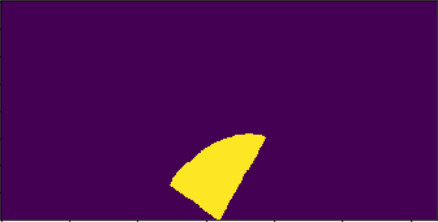

[//]: # (Image References)
[image_0]: ./misc/rover_image.jpg
[](https://www.udacity.com/robotics)
# Search and Sample Return Project
This project helped us in understanding how the perception, decision making and actuation are handeled in real life robotics.


Please click on following image to watch the video
<p align="center">
  <a href="http://www.youtube.com/watch?v=Zu-8fPl4TfM"></a>
</p>

## Notebook Analysis 

### process_image() function
The prcess_image function was modified to accomplish following:
1) Initially, I defined the grid size and bottom offset from the rover to the camera image start value.
2) Then, I used perspective_transform function to identify warped image and got the mask as well.
3) The perspective transform function takes three inputs: image, source, and destination. The image is captured from the data. However, the source was marked manually using the grid plot in simulation. The destination was calculated based on grid size.
4) After that I appled color_thresh functions to identify navigable terrain and obstacle map
5) Then, Identified the pixel values of the where navigable terrain using the images generated from color_thresh function. Similarly, identifed the pixel values of obstacles
6) I converted the pixel values of navigable terrain and obstacle map to the world coordinates so that we can plot it on map.
7) On the map, when robot moves, it marks navigable terrain in blue and obstacles as red.
8) The next step was to find the rock in the give scene. I used the find_rocks function on the warped image generated from perspective_transform function to find the pixel location of the rock. Similar to point 6, I converted the pixel values of rock to world frame of reference. The rock will be marked as white dot on the map.

Here are the details of implementation:
```python
def process_image(img):
    image = np.copy(img)
    # TODO: 
    # 1) Define source and destination points for perspective transform
    dst_size = 5 
    bottom_offset = 6
    source = np.float32([[14, 140], [301 ,140],[200, 96], [118, 96]])
    destination = np.float32([[image.shape[1]/2 - dst_size, image.shape[0] - bottom_offset],
                      [image.shape[1]/2 + dst_size, image.shape[0] - bottom_offset],
                      [image.shape[1]/2 + dst_size, image.shape[0] - 2*dst_size - bottom_offset], 
                      [image.shape[1]/2 - dst_size, image.shape[0] - 2*dst_size - bottom_offset],
                      ])
    # 2) Apply perspective transform
    warped, mask = perspect_transform(image, source, destination)
    # 3) Apply color threshold to identify navigable terrain/obstacles/rock samples
    threshold = color_thresh(warped)
    obs_map = np.absolute(np.float32(threshold)-1) * mask
    
    # 4) Convert thresholded image pixel values to rover-centric coords
    xpix, ypix = rover_coords(threshold)
    obs_xpix, obs_ypix = rover_coords(obs_map)
    # 5) Convert rover-centric pixel values to world coords
    x_pix_world, y_pix_world = pix_to_world(xpix, ypix, data.xpos[data.count], data.ypos[data.count], data.yaw[data.count], 200,10)
    obs_x_pix_world, obs_y_pix_world = pix_to_world(obs_xpix, obs_ypix, data.xpos[data.count], data.ypos[data.count], data.yaw[data.count], 200,10)
    # 6) Update worldmap (to be displayed on right side of screen)
    data.worldmap[y_pix_world, x_pix_world, 2] = 255
    data.worldmap[obs_y_pix_world, obs_x_pix_world, 0] = 255
    navpix = data.worldmap[:,:,2]>0
    data.worldmap[navpix,0] =0
    rock_map = find_rocks(warped,levels=(110,110,50))
    if rock_map.any():
        rock_x,rock_y = rover_coords(rock_map)
        rock_x_world, rock_y_world = pix_to_world(rock_x,rock_y,data.xpos[data.count], data.ypos[data.count], data.yaw[data.count], 200,10)
        
        data.worldmap[rock_y_world,rock_x_world,:] = 255
    # 7) Make a mosaic image, below is some example code
        # First create a blank image (can be whatever shape you like)
    output_image = np.zeros((img.shape[0] + data.worldmap.shape[0], img.shape[1]*2, 3))
        # Next you can populate regions of the image with various output
        # Here I'm putting the original image in the upper left hand corner
    output_image[0:img.shape[0], 0:img.shape[1]] = img

        # Let's create more images to add to the mosaic, first a warped image
    warped,mask = perspect_transform(img, source, destination)
        # Add the warped image in the upper right hand corner
    output_image[0:img.shape[0], img.shape[1]:] = warped

        # Overlay worldmap with ground truth map
    map_add = cv2.addWeighted(data.worldmap, 1, data.ground_truth, 0.5, 0)
        # Flip map overlay so y-axis points upward and add to output_image 
    output_image[img.shape[0]:, 0:data.worldmap.shape[1]] = np.flipud(map_add)


        # Then putting some text over the image
    cv2.putText(output_image,"Populate this image with your analyses to make a video!", (20, 20), 
                cv2.FONT_HERSHEY_COMPLEX, 0.4, (255, 255, 255), 1)
    if data.count < len(data.images) - 1:
        data.count += 1 # Keep track of the index in the Databucket()
    
    return output_image
```


### Rock Identification
I have added a function named find_rocks. This function identifies the golden sample present in the image taken by the Rover.
```python
def find_rocks(img,levels=(110,110,50)):
    rockpix = ((img[:,:,0]>levels[0])&(img[:,:,1]>levels[1])&(img[:,:,2]<levels[2]))
    rock_image = np.zeros_like(img[:,:,0])
    rock_image[rockpix] = 1
    return rock_image
```
Following is the example of input amd output image.


### Obstacle Identification
To identify the obstacles in the environment, I have identified the areas which are not navigable.
```python
threshold = color_thresh(warped)                    #Navigable areas
obs_map = np.absolute(np.float32(threshold)-1)      #Obstacles
```
There was a mask introduced in the perspective_transform function to make sure that robot captures just the relevant part of the image. Hence, the perspective transform function was changed to 
```python
def perspect_transform(img, src, dst):
           
    M = cv2.getPerspectiveTransform(src, dst)
    warped = cv2.warpPerspective(img, M, (img.shape[1], img.shape[0]))# keep same size as input image
    
    #Added following line
    mask = cv2.warpPerspective(np.ones_like(img[:,:,0]), M, (img.shape[1], img.shape[0]))
    
    return warped,mask
```
After multiplying the mask with the threshold image, we got following results:


## Autonomous Navigation and Mapping
### Optimal Implementation Theory
There are number of ways to accomplish this task. However, the best way  is to use Depth first search. Here is how depth first search will work on this problem: Suppose the robot is at the center of the map. Please look at following image. There are three possible direction that robot can go into. Let's call that three branches. It will completely visit one branch or let's say map one branch before visiting another one. This will ensure that no brances are visited twice. In this case, the limitation we have is that the sensor that we are using is not scanning complete 360 degree feild of view. Hence, to implment depth first search, we would have to rotate the robot at current position, identify all the navigable nodes and mark it. Ofcourse, we would have to divide the scanned area in definite sized grid otherwise we will end up with too many nodes and robot will have to visit all of them.

<p align="center">

</p>

### My Implementation
As we have limitation over the sensor, I went with the approach of following the wall as suggested in hints. 

#### Wall following
To accomplish this task, I defined a vector (in code it is actually defined as an ellipse of very small thickness) of small size which basically goes from negative angle to postive angle in the field of view of robot and returns the angle where there is no collision. After I get the direction of no-collision, I use that vector to make a mask in ellispsoidal shape. When I apply this mask to the navigable pixels, I get the direction in which robot has to go to remain close to wall. In following image, Red indicates non-navigable terrain, Black indicates navigable terrain, Blue is the mask to follow wall, and Green is the vector that I am using for checking collision.

<p align="center">

</p>

As I am going from negative angle to postive angle, I will always have the tendancy to follow the left wall. 

I wrote a function to draw me the vector (In code it is defined as variable FrontalCollisionMask) and ellipsoidal mask (WallFollowMask)
```python
def ArcMaskGenerator(mask,axes,center,angle,startAngleDegrees,endAngleDegrees):
    cv2.ellipse(mask,center,axes,angle,startAngleDegrees,endAngleDegrees,1,thickness=cv2.FILLED)
    return mask
```
I am calling this function inside perception_step. For more details, please continue reading.

#### Rock Identification and pick up
My robot behaves in greedy manner. Basically, as soon as the robot identifies the golden samples, it picks it up. However, the policy for searching is following the left wall. Thus, I was running into issues of skipping the rest of the path whenever the robot identifies a rock on the other i.e. right side of the pathway. Hence, I have applied the similar mask for the Rock detection as well. However, unlike WallFollowMask, RockMask is static. Please refer to following image of RockMask.
<p align="center">

</p>

Now, let's dig deeper into perception step.


#### Perception Step
This function is responsible for sensing the world around robot. It will give a direction where robot can go safely. Here is how it is implemented in the code.

1) Initially, I have defined a variable Update_map which I am using later to decide whether to update the map or not given the robot position. Also, defined the variables that I will be using to process image.
```python
def perception_step(Rover):
    # Perform perception steps to update Rover()
    # TODO: 
    # NOTE: camera image is coming to you in Rover.img
    Update_map = False
    # 1) Define source and destination points for perspective transform
    dst_size = 5 
    bottom_offset = 6
    source = np.float32([[14, 140], [301 ,140],[200, 96], [118, 96]])
    image = Rover.img
    destination = np.float32([[image.shape[1]/2 - dst_size, image.shape[0] - bottom_offset],
                      [image.shape[1]/2 + dst_size, image.shape[0] - bottom_offset],
                      [image.shape[1]/2 + dst_size, image.shape[0] - 2*dst_size - bottom_offset], 
                      [image.shape[1]/2 - dst_size, image.shape[0] - 2*dst_size - bottom_offset],
                      ])
```
2) Applied, perspective transform to get the warped image and mask.
3) Identified navigable terrain and obstacle map
4) Populated those on the left side of the screen
```python
    # 2) Apply perspective transform
    warped,mask = perspect_transform(Rover.img, source, destination)
    # 3) Apply color threshold to identify navigable terrain/obstacles/rock samples
    threshed = color_thresh(warped)
    obs_map = np.absolute(np.float32(threshed)-1)*mask
    # 4) Update Rover.vision_image (this will be displayed on left side of screen)
    Rover.vision_image[:,:,0] = obs_map * 255
    Rover.vision_image[:,:,2] = threshed * 255
```
5) Get coordinates of navigable terrain and obstacles. This will give us pixels position in rover centric coordinates.
6) We need to convert the rover centric coordinates to world frame of reference. 
7) Now, we need to update the world map using this data. However, as we are capturing the data using a camera on Rover, we need to make sure that we don't capture any false positive. To avoid that I am only capturing the data when the robot is flat on the ground. 
```python
    # 5) Convert map image pixel values to rover-centric coords
    xpix, ypix = rover_coords(threshed)
    obs_xpix, obs_ypix = rover_coords(obs_map)
    # 6) Convert rover-centric pixel values to world coordinates
    world_map_size = Rover.worldmap.shape[0]
    scale = 2 * dst_size
    x_pix_world, y_pix_world = pix_to_world(xpix, ypix, Rover.pos[0],Rover.pos[1],Rover.yaw, world_map_size,scale)
    obs_x_pix_world, obs_y_pix_world = pix_to_world(obs_xpix, obs_ypix, Rover.pos[0],Rover.pos[1],Rover.yaw, world_map_size,scale)
    # 7) Update Rover worldmap (to be displayed on right side of screen)
    # Update map only when robot is flat on the ground

    update_map_threshold = 0.5
    if Rover.pitch > 180 and Rover.roll > 180:
        if (360-Rover.pitch) < update_map_threshold and (360-Rover.roll) < update_map_threshold:
            Update_map = True
    elif Rover.pitch < 180 and Rover.roll > 180:
        if (Rover.pitch) < update_map_threshold and (360-Rover.roll) < update_map_threshold:
            Update_map = True
    elif Rover.pitch > 180 and Rover.roll < 180:
        if (360-Rover.pitch) < update_map_threshold and (Rover.roll) < update_map_threshold:
            Update_map = True
    else:
        if (Rover.pitch) < update_map_threshold and (Rover.roll) < update_map_threshold:
            Update_map = True
    
    if Update_map:
        Rover.worldmap[obs_y_pix_world, obs_x_pix_world,0] += 1
        Rover.worldmap[y_pix_world, x_pix_world, 2] += 20
```
8) I am making the rock mask, frontal collision vector, and wall follow mask here. This is explained previously.  
    The found direction is telling us whether we found a direction where we are not colliding. If we couldn't find any direction, the robot will rotate at its current position and stop when it actually finds a direction. 
    Note that there is a tolerance built into this to avoid any false data. The variable too_much_collision is the allowance. This indicates a count of non-navigable pixels. min_collision_i is the angle when the collision is minimum. This is later used to decide the correct driving direction. 

```python
    # 8) Draw a vector to avoid frontal collision,  WallFollowMask and Rock mask
    cen = (160,160)   # Center for drawing the ellipse
    RockMask = np.zeros_like(image[:,:,0])    #only identify the rocks which are on near left wall.
    RockMask = ArcMaskGenerator(RockMask, (45,70),cen,-144,0,80)
    rock_map = find_rocks(warped,RockMask,levels=(110,110,50))
        
    WallFollowMask = np.zeros_like(image[:,:,0])
    found_direction = False
    min_collision = 0
    min_collision_i = -145
    too_much_collision = 3

    for i in range(-108,-72,2): # Go through iteration from negative angle to positive angle as in rover's percpective to get a direction of less collision.
        FrontalCollisionMask = np.zeros_like(image[:,:,0])
        FrontalCollisionMask = ArcMaskGenerator(FrontalCollisionMask,(20,3),cen,i,-90,90) 
        FrontalCollisionMask[int(FrontalCollisionMask.shape[0]*0.95):,:] = 0
        x_collision, _ = rover_coords(abs(1-threshed) * FrontalCollisionMask)
        if len(x_collision) == 0:
            found_direction = True
            break

        if (min_collision == 0 or len(x_collision) < min_collision):
            min_collision = len(x_collision)
            min_collision_i = i

    
    if found_direction:
        Rover.drive_direction = i
        Rover.found_direction = found_direction
    else:
        if (min_collision == 0 or min_collision > too_much_collision):
            Rover.drive_direction = 0
            Rover.found_direction = False
        else:
            Rover.drive_direction = min_collision_i
            Rover.found_direction = True
    
    #Truncate the mask using Rover.drive_direction
    WallFollowMask = ArcMaskGenerator(WallFollowMask,(65,23),cen,Rover.drive_direction,-90,83) 
```
9) You might say that why is there a need of identifying navigable pixel if we are already calculating drive direction based on the frontal collision vector. However, we are doing this to avoid any instaneous motion of robot's steering. Hence, once we are getting Rover.drive_direction, we use that to create a WallFollowMask and do the mean of navigable terrain to find most suitable direction of motion. Also, following code also include greedy behaviour of the robot i.e. get the golden samples if there are any.
```python
    # 9) Get navigable pixels using the updated WallFollowMask and use it to get the navigable pixels
    xpix_nav,ypix_nav = rover_coords(threshed * WallFollowMask)
    
    if rock_map.any():
        rock_x,rock_y = rover_coords(rock_map)
        rock_x_world, rock_y_world = pix_to_world(rock_x,rock_y, Rover.pos[0],Rover.pos[1],Rover.yaw, world_map_size,scale)
        dist_rock, angle_rock = to_polar_coords(rock_x,rock_y)
        Rover.nav_dists = dist_rock
        Rover.nav_angles = angle_rock

        rck_idx = np.argmin(dist_rock)
        rck_xcen = rock_x_world[rck_idx]
        rck_ycen = rock_y_world[rck_idx]
        Rover.worldmap[rck_ycen, rck_xcen, :] = 255
        Rover.vision_image[:,:,1] = rock_map * 255
        Rover.Rock_found = True
    
    else:
        Rover.vision_image[:,:,1] = 0
        distance, angles = to_polar_coords(xpix_nav,ypix_nav)
        Rover.nav_dists = distance
        Rover.nav_angles = angles
        Rover.Rock_found = False

    return Rover

```


### Issue with current implementation
There is one issue in my implementation and I know how to solve it. However, I am getting too late for submitting this project and would like to submit this project soon.

The robot sometimes run into obstacles as it is not utilizing the full field of view to plan the path. It makes it stuck sometimes. To make it unstuck, I have added the logic which makes the robot turn on its own position if it get stuck at one position for more than 8 secs. One more thing that I wanted to add is to define the configuration space (C-Space) for the robot. So that robot would avoid going close to the obstacles and plan path away from the obstacles.

### Remaining Implementation:
The only thing that is remaining in this implementation is to command the robot to go to the start position when all the samples are collected. The algorithm that could do this quickly is RRT* as we know the start position of the robot and we know the current position of the robot. We can start the Rapidly-growing random tree on the start position and on the current position and wait for them to merge. Once they merge, we will have path to follow. We can also make it goal directed so that the tree can grow in the direction of where it wants to go.


